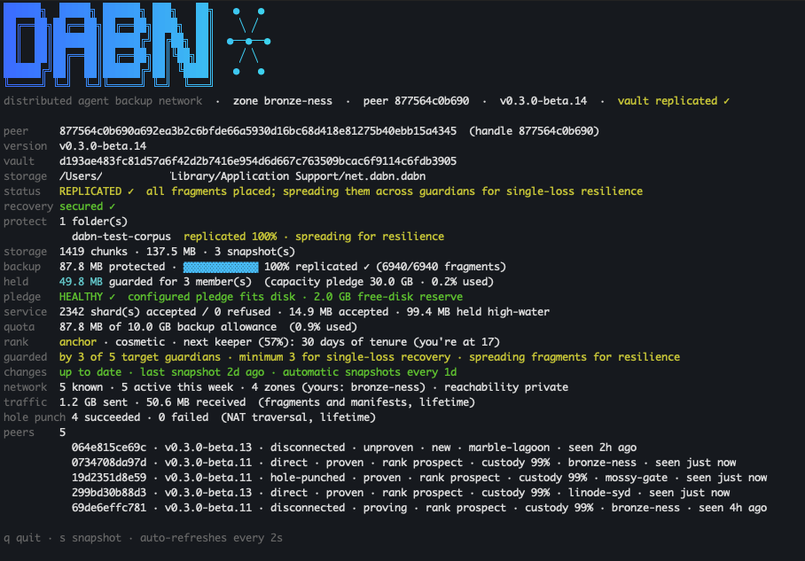
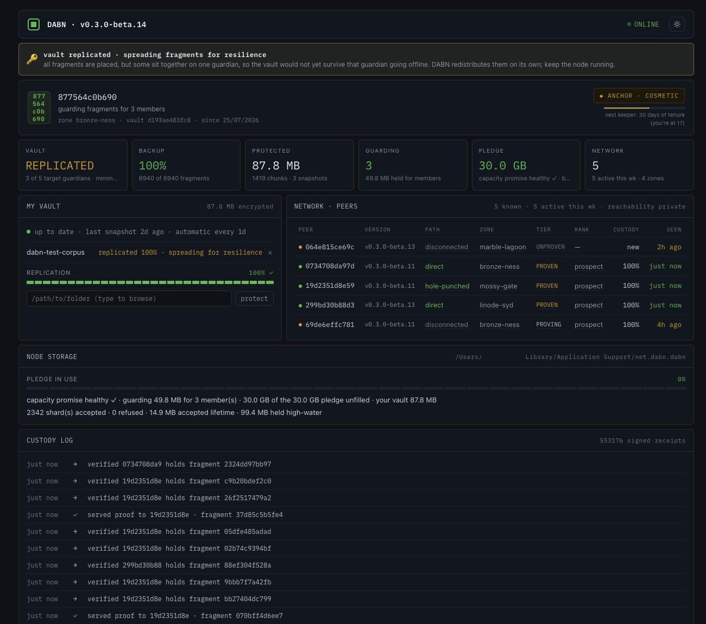

# DABN: Distributed Agent Backup Network

DABN is a peer-to-peer backup network for AI-agent state and personal data.
Members store encrypted fragments for one another, verify continued custody,
and build local trust from observed service rather than self-reported claims.

> **Beta status:** DABN beta.14 supports macOS, Linux, and Windows and has been
> validated across a live multi-site fleet, including backup, restore,
> total-loss recovery, NAT traversal, and managed background services. It is
> being introduced through a small invited beta. Keep an independent
> conventional backup and begin with noncritical data. Admission of
> uncoordinated public testers remains gated on the network-verifiable
> contribution enforcement defined in
> public-readiness.md.

## Backup and custody model

- **You choose folders to protect.** DABN compresses and encrypts their files
  locally, then splits the encrypted chunks into fragments. Backup plaintext
  does not leave the source node.
- **Fragments spread across other members' machines** ("guardians"). Guardians
  hold ciphertext they cannot read. At full target placement, any 3 of 5
  fragments can rebuild a chunk, so two fragment holders may be unavailable.
- **In return, your node guards fragments for others.** To grow its retained
  vault by one byte, it pledges three bytes of capacity for other members.
  Nodes continuously challenge guardians to prove they still hold what they
  promised, and placement prefers peers with a locally witnessed history of
  successful checks.
- **Your storage pledge is a capacity promise, not reserved space.** You decide
  how much to offer, and you can raise it whenever you want to protect more. The
  space fills gradually, as encrypted fragments arrive. The stock client will not
  let you lower the pledge below what your own vault and the fragments you
  already hold require, checks that it fits the disk, and keeps a free-space
  margin in reserve. If other software later consumes the space, DABN keeps
  existing fragments but refuses new ones, senders try other guardians, and new
  backup growth pauses until the pledge is credible again. These are local
  guardrails, not yet proof to other nodes; that distinction is why the beta
  remains invited.
- **Your 24-word recovery phrase is the root recovery secret.** It can recreate
  the node identity and vault keys on a replacement machine. A running node
  keeps working key material in its protected data directory, so host and
  account security remain part of the threat model.
- **Abandoned data ages out.** When a node disappears for good, the fragments
  it left behind are gradually reclaimed rather than accumulating forever.

Public-network startup obtains bootstrap peers from a signed, regularly
refreshed official directory and fails closed unless the resulting set is
sufficiently diverse and the node passes its local safety checks. Manual peers
can supplement the directory.

## Terminal and web dashboard

`dabn status --watch` provides a terminal view of vault health, replication,
guardians, peer paths, storage use, and custody checks, with a compact live
banner and keyboard controls:



The same operational state is available in the loopback-only web dashboard:



## Where your node lives (and moving it)

The data directory **is** the node: identity key, config, the encrypted
vault, and the fragments you guard. `dabn init` shows the location before
writing anything and (interactively) offers to put it elsewhere; the choice is
remembered, so no flags are needed afterwards. It's also shown at daemon startup, in
`dabn status` (the `storage` line, with pledge usage), and in the dashboard's
NODE STORAGE panel. To relocate it later (say, onto a bigger disk), stop
`dabn up` and run:

```bash
dabn move-data /Volumes/BigDisk/dabn-node
```

The move is guarded: copy → **verify every byte** → save the new location →
only then remove the old copy, so an interruption never leaves you without a
complete node. The new location is remembered (a small locator at the platform
default), so plain `dabn` commands keep working with no flags. Two rules: a
`--data-dir`/`DABN_DATA_DIR` override always wins over the saved location (and
a move of an override-addressed node leaves the override for you to update),
and if the saved directory ever goes missing (an unmounted volume), DABN
**fails loudly** rather than silently starting a second identity at the
default. Local disks only: SQLite locking is unreliable on network filesystems.

## Quickstart (single node / private trial)

```bash
dabn init                  # first run: creates the node and shows its phrase once
dabn confirm-recovery      # clears the terminal, then verifies your off-node copy
dabn protect ~/some/dir    # protect a folder: adds it AND backs it up now
dabn service install       # keep it running after logout/reboot
dabn snapshot              # optional: capture changes now (also automatic daily)
dabn status                # health, peers, replication progress, and change freshness
dabn status --watch        # live monitor view (q to quit; auto-refreshes every 2s)
```

`dabn init` refuses to overwrite an existing node and does not display an
existing recovery phrase again. Store the phrase off this machine when it is
first shown, then use `dabn confirm-recovery` to verify your saved copy.

Plain `dabn up` is the stranger-network mode. On startup, DABN downloads and
verifies the official bootstrap directory, randomly chooses from its healthy
entries while preferring different operators and hosts, and merges those peers
with any addresses you added manually. Public startup still requires at least
three bootstrap identities across two or more public hosts, so a small
formation network may need `--controlled` until enough independent seeds have
been approved. Run `dabn doctor` to see every local readiness failure at once.
`--controlled` is the
explicit escape hatch for a private LAN, development network, or formation of
the first infrastructure set and prints a warning when used.

For routine operation, use `dabn service install` instead of leaving a terminal
attached to `dabn up`. DABN installs a user-owned systemd service on Linux, a
LaunchAgent on macOS, or a login startup task on Windows. See
background-service.md for lifecycle commands,
platform persistence, logs, and the controlled/private distinction.

`dabn up` prints the DABN banner on start, and `dabn status --watch` opens a
full-screen live view, banner and status pinned at the top, auto-refreshing
every 2s, with keys: `q`/Esc to quit, `s` to snapshot now, `r` to refresh.
Handy over SSH on a headless guardian, no browser needed. It uses truecolor on a
terminal and falls back to a plain reprint loop when piped or under `NO_COLOR`.

The recovery phrase (a BIP39 mnemonic) is the portable secret that restores the
node after total machine loss. Keep it separately from the node data directory;
losing both makes the encrypted backup unrecoverable by design.

## Your vault

Your **vault** is the encrypted copy of everything you've protected, not the
folders themselves, and not the machine. Each snapshot splits your files into
content-addressed chunks, seals every chunk under your master key (derived from
the recovery phrase), and stores the sealed chunks plus a **manifest** (the
file tree that says how to reassemble them) inside your node's storage
directory. That collection is the vault:

- **It outlives the source folders.** Delete or lose the originals; the vault
  still holds the data, and `dabn restore` rebuilds them bit-for-bit. (It's
  also why the reclamation keepalive doesn't need your originals on disk.)
- **It's what guardians protect without ever seeing it.** The vault's chunks
  are erasure-coded into fragments spread across guardians, with the manifest
  held as an opaque encrypted blob. Guardians store ciphertext at blinded
  addresses; on the network the vault is known only by its **vault id**, a
  hash of your public identity that reveals nothing about the contents.
- **It's what the status ladder grades.** `empty → at_risk → local_only →
  syncing → replicated → protected` distinguishes transfer progress from
  enough guardian diversity to survive losing one guardian.
- **It resurrects.** On a fresh machine the recovery phrase re-derives your
  keys and vault id, the DHT finds your guardians, and `dabn recover`
  reassembles the vault byte-for-byte.

The dashboard's MY VAULT panel and the "your vault N" figure in NODE STORAGE
are this: your own encrypted bytes in local storage, as distinct from the
fragments you guard for other members.


## Managing what you protect

The capture policy is just a list of directories, and you can add to it any time:

```bash
dabn protect ~/another/dir                # adds it AND backs it up now
dabn protect ~/another/dir --no-snapshot  # add to the policy only, snapshot later
dabn unprotect ~/another/dir              # stop protecting it and reclaim the space
```

`protect` backs up the folder immediately (it snapshots for you); `--no-snapshot`
defers the first capture if you'd rather add several folders and
`dabn snapshot` once.
The dashboard has the same flow with a built-in folder picker: the path field
completes as you type (arrow keys to highlight, Tab or click to descend into a
folder). The local daemon supplies the directory names; nothing is uploaded
through the browser, which never sees your filesystem directly.
While `dabn up` is running, it checks protected sources every **24 hours** by
default and takes a new snapshot only when files were added, modified, or
removed. Run `dabn snapshot` whenever you want to capture sooner. Change
`snapshot_interval_secs` in the node's `config.json` and restart the daemon to
use another cadence; `0` disables automatic snapshots.

Snapshots are content-addressed and deduplicated: each new snapshot covers
**all** protected dirs in one manifest, but only genuinely new chunks are
stored and shipped. So adding a folder later re-uses everything already backed
up and only replicates the delta. Snapshots are retained **3 deep**
(`retain_snapshots` in config): after each new snapshot, versions older than
the window are garbage-collected, and their fragments are released from
guardians, so an actively edited vault stays bounded instead of growing
forever.


`unprotect` is the reverse and it's **irreversible** (so it prompts, or takes
`--yes`; the dashboard has a per-folder "×"). It removes the folder from the
capture policy, frees its **exclusive** chunks locally (shared/deduped chunks that
another protected folder still needs are kept), and sends each guardian an
**authenticated release** so they drop those fragments and reclaim the space. That
folder is no longer recoverable afterward. Releases are queued and delivered by the
running daemon, so an offline guardian is simply retried later.

**Guardian outages repair eagerly and retire slowly.** Once a custody attempt
witnesses that a guardian is unreachable, its fragments stop counting as
available redundancy and the running owner places temporary replacement copies
on other live guardians. The old placement records remain for the normal
21-day continuous-outage window: if the guardian returns, DABN keeps the older
assignments where that preserves the safest guardian spread, and durably queues
surplus copies for authenticated release; if it stays away, the stale rows are
finally retired. This restores redundancy without declaring a brief outage
permanent. Repair requires the owner node's local encrypted vault and reachable
guardians with capacity. It
cannot manufacture lost bytes after the owner is also gone: a 3-of-5 vault with
fewer than three surviving network fragments is no longer recoverable from the
phrase alone.

**Abandoned data reclaims itself, gently.** A guardian treats each custody
challenge from you as a *keepalive*: it keeps your fragments as long as it keeps
hearing from you. Go completely silent, with no node running under your recovery phrase
for the whole grace window (default **~6 months**, a per-guardian policy), and your
data becomes *eligible* for reclamation. Eligibility isn't deletion: reclamation is
**lazy and pressure-driven**, so a guardian only drops eligible data when it
actually needs the room, and then evicts the **longest-silent owner first**. It's a
per-guardian queue ordered by silence that you leave the instant your node
reconnects. So to stay protected you just need a node under your phrase online at
least once within the window; it keepalives automatically, doesn't need the
original folders on disk (it runs off the vault store), and needn't be the same
machine.

`dabn status` and the dashboard's **My node** panel show a live **backup**
progress bar (fragments placed vs. the snapshot's target, chunks × n) so you
can watch a newly-added folder replicate to guardians and climb to 100%. They
also show a **change-freshness** line, how many files have changed on disk since
your last snapshot (a cheap `stat`-only check), so you always know whether a
`dabn snapshot` is due, and a **per-folder** breakdown so a freshly-added folder
reads `syncing` while the rest stays `protected`.

## Connect peers

On the same LAN, nodes **auto-discover** each other over mDNS; run
`dabn up --controlled`
on each; there's no manual step. To connect across networks (e.g. over a tailnet),
add the guardian by the **libp2p multiaddr** it prints on startup:

```bash
# guardian:  dabn init && dabn up --controlled → logs listening: /ip4/…/p2p/<id>
dabn peer add /ip4/<host>/tcp/<port>/p2p/<peer-id>    # e.g. a tailscale IP
dabn custody                                          # challenge peers now (also automatic)
```

An added address is saved as a manual bootstrap seed, so the daemon re-dials it
on startup and discovers the rest of the network through the DHT. Manual peers
supplement the signed official directory; ordinary users do not need to copy a
regularly changing list into their configuration.

## Bootstrap seeds and Bridges

DABN uses two independent public-infrastructure roles:

- A **bootstrap seed** (also called a Beacon) gives a new node its first contact
  with the DHT so it can discover other peers. A node becomes an official seed
  when its persistent identity and fixed public addresses are approved for the
  signed bootstrap directory.
- A **Bridge** is a bounded libp2p relay for nodes that cannot initially reach
  one another through NAT. Setting `"relay_server": "on"` enables this relay
  server; it does not by itself make the node a bootstrap seed. Relay serving
  defaults to `off` and always requires an explicit operator opt-in. Ordinary
  nodes can still use Bridges without becoming one.

A public machine may run either role or both. A bootstrap seed does not need to
be a Bridge, and a Bridge does not need to appear in the bootstrap directory.
Combining them on a small public VPS is convenient, which is why the initial
Sydney Linode performs both roles.

The normal connection sequence is:

1. A new node contacts one or more bootstrap seeds from the signed directory.
2. It discovers other nodes through the DHT and tries to connect directly.
3. If NAT prevents a direct connection, a Bridge carries bounded discovery,
   authentication, address-exchange, and hole-punch coordination traffic.
4. Once a direct connection exists, backup fragments and recovery downloads
   travel directly between the two nodes.

DABN never uploads backup fragments or downloads recovery data over a relay
circuit. If it cannot establish a direct path to a peer, that peer is not
eligible for the bulk transfer. Bridge operators can inspect reservations,
circuits, hole-punch outcomes, per-peer activity, and conservative relay-use
bounds with `dabn status` or the local dashboard. The default policy limits a
circuit to 8 MiB and reserves at most 1 GiB of circuit allowances in any rolling
hour. See the infrastructure-node
runbook to operate either role and submit a node-signed
bootstrap candidate with `dabn bootstrap propose --operator <GITHUB_USER>`.
The command shows the complete public proposal and prints a copyable GitHub
link; it needs no GitHub credentials or browser on the node. The
bootstrap-directory guide explains review and
automated health publication.

## Standing: ranks and trust tiers

DABN measures two different things about a node, on two separate axes.
Neither can be self-claimed: both are computed from witnessed behaviour, and
neither is ever inferred from the other.

**Your rank** is your node's public standing, earned by service:

| Rank | Requires | Meaning |
|---|---|---|
| Newcomer | nothing yet | just joined |
| Prospect | 1 peer relying on you | someone trusts you with data |
| Anchor | 1 peer, 7 days of tenure | dependable over time |
| Keeper | 3 peers, 30 days | broad and durable |
| Pillar | 8 peers, 90 days | a major, established contributor |
| Paragon | Pillar, 365 witnessed custody days, Established Beacon or Bridge | exemplary network service |

Rank is driven by **breadth** (how many distinct members' fragments you guard)
and **tenure**. Breadth requires real peers choosing to place data on you;
through Pillar, tenure is currently calendar age since the node first stored
anything and rank remains cosmetic. Custody pass-counts are deliberately not
used, since they inflate with a single busy peer's challenge frequency.
Paragon is fail-closed: DABN will not award it until the network can supply a
365-day witnessed custody record plus an independently qualified infrastructure
distinction. Local configuration alone can never mint it.

The Beacon and Bridge infrastructure roles described above are a parallel,
composable distinction. Any node may opt in and set service limits, regardless
of custody rank. Public infrastructure is currently configured deliberately by
operators. Automatic witnessed qualification and selection remain post-open
work and will not rely on self-reported status.

Automatic volunteer qualification and witnessed role tenure are future work.
Until that evidence exists, Pillar is the highest rank DABN can award.
Recoveries, raw connection counts, relay bytes, and self-reported activity
never earn rank because related identities can manufacture them. See
docs/reputation.md for the complete model and its safety
boundaries.

**Trust tiers** point the other way: how your node privately rates each peer
before trusting it with your fragments. The ladder is `unproven → proving →
proven`, computed from that peer's custody-proof history with you: 20 passed
checks to reach proving; 500 passes, 14 days of witnessed age, and a 95% pass
rate to reach proven. Tier dominates placement, so load-bearing fragments go
to proven peers first and a fresh identity can only ever hold dispensable
parity. There is no global score: every node keeps its own opinion of every
peer, built solely from the checks it issued itself.

What you offer the network is shown directly as the capacity pledge, together
with its live health, accepted/refused placement counts, and held high-water
mark. Rank remains explicitly cosmetic: DABN does not turn self-reported
capacity into quota, rank, or privileged placement.

If other software consumes enough disk to make the configured promise
incredible, status and the local dashboard show the promised, currently held,
credible, and reserved amounts. Free space or enlarge the disk when possible;
otherwise intentionally reduce only the unhealthy promise with:

```bash
dabn share --fit-disk
```

The command keeps an additional 5% cushion beyond the configured free-space
reserve, rounds down to a clean two-significant-digit value at the capacity's
current GiB, MiB, or KiB scale, and never goes below the vault and guarded
fragments the node must already cover.

## Recover after total loss (resurrection)

On a fresh machine, holding only your recovery phrase:

```bash
dabn restore-identity                 # securely prompts; phrase is not a CLI argument
dabn recover --list                                   # browse folders, downloads nothing
dabn recover --dest ~/restored                        # rebuild the whole vault, bit-for-bit
dabn recover --dest ~/restored --only agent-memory    # …or just one folder, fetching only its data
```

Your guardians advertise your vault in the DHT, so a fresh node finds them from
the phrase plus the signed official bootstrap directory; no saved peer list is
required. A manual `dabn peer add <multiaddr>` remains available if the
directory cannot be reached.
`recover --list` fetches and decrypts only the (small) manifest, so you can see
what's recoverable (top-level folders with file counts and sizes) before
pulling anything; guardians hold that manifest as an opaque encrypted blob, so
the folder names stay private to you. `--only <folder>` then restores just that
folder, gathering only its fragments.

## Use it manually or through an AI agent

Agent-assisted DABN is not a separate installation or a different kind of
node. It adds a bounded control path to the same node, vault, daemon, status,
dashboard, peers, and recovery phrase:

| | Manual use | Agent-assisted use |
|---|---|---|
| Who chooses folders? | You, with `dabn protect <dir>` | Your agent, inside a boundary you approve |
| How are they captured? | `protect` snapshots immediately | The agent's `protect_path` snapshots immediately |
| Can you still use the CLI/dashboard? | Yes | Yes—the agent does not take them over |

In both modes, initialize and secure recovery first and connect peers as
normal. `dabn agent setup` offers to install and start the long-running DABN
daemon with the operating system. The daemon stores and replicates snapshots
and recaptures changed protected folders every 24 hours by default. It does not
silently select or capture your whole home directory.

### Hermes Agent

Run setup as the OS account that owns both Hermes and this DABN node:

```bash
dabn agent setup
```

DABN shows the proposed profile and home boundary:

```text
agent profile:  hermes
agent home:     /home/agent-user
  Your agent will choose important folders inside this location.
  DABN will back up those selections automatically.
Is this your agent's home folder? [Y/n]
```

Accepting creates permission to add narrower folders beneath `/home/agent-user`;
it does **not** immediately back up the entire directory. Setup then offers:

```text
Keep DABN running automatically in the background? [Y/n]
```

Accepting installs and starts the native Linux, macOS, or Windows background
integration. A private/test network also requires an explicit controlled-mode
confirmation (or `dabn agent setup --yes --controlled` for scripted setup).
If the `hermes` command is installed, DABN then offers to connect itself:

```text
Hermes Agent detected.
Connect DABN to Hermes Agent now? [Y/n]
```

Accept that prompt and Hermes's tool-enable prompt, then start a new Hermes
session. Hermes launches `dabn mcp --profile hermes` when it needs the tools;
do not run that MCP command yourself or install it as a service. The separate
background DABN daemon remains owned by the operating system.

Connecting the MCP server makes DABN available to Hermes; it does not itself
start an AI task. Setup therefore finishes with a first task to paste into a
new Hermes session:

> Use DABN to inspect your approved folders and back up the important, durable
> state you would need to recover after losing this machine.

The DABN tool instructions already tell Hermes to inspect before choosing, skip
caches and regenerable data, and consider newly created or discovered durable
directories during normal work. Daily snapshots of folders already protected
are DABN's job. An unattended periodic AI review is only needed if the operator
wants the agent to search for entirely new important locations while no normal
agent session is active.

Verify the result with:

```bash
dabn agent permissions hermes
hermes mcp list
dabn status
```

Rerunning `dabn agent setup` is safe: an existing grant is retained and an
existing Hermes connection is reported rather than duplicated.

### Other agent harnesses

The MCP protocol and safety model are harness-neutral. If DABN does not yet
have a setup adapter for the installed harness, it prints the exact executable
and arguments to enter in that harness's local MCP configuration:

```json
{
  "mcpServers": {
    "dabn": {
      "command": "/absolute/path/to/dabn",
      "args": ["mcp", "--profile", "my-agent"]
    }
  }
}
```

The local stdio bridge supports both MCP `2026-07-28` stateless discovery and
older initialization-based clients; version negotiation is automatic.

For unusual service accounts or layouts, create the grant explicitly:

```bash
dabn agent grant my-agent --protect-within /srv/my-agent
```

DABN gives the agent neutral filesystem facts and relies on its knowledge of
its own memory, configuration, skills, and workspaces to choose what matters.
It enforces the approved boundary and records every agent-added path and
reason. The agent cannot widen its grant, unprotect data, obtain recovery
material, restore/decrypt files, or delete node data. See
docs/agent-mode.md for the complete setup, process model,
fallback configuration, and troubleshooting.

## Workspace layout

| Crate | Role |
|---|---|
| `dabn-core` | crypto, chunking, manifests, receipts, key derivation, the seam traits |
| `dabn-daemon` | SQLite store, engine, libp2p network service, dashboard + agent APIs, scheduler |
| `dabn-mcp` | MCP stdio server (talks to the daemon's loopback API) |
| `dabn-cli` | the `dabn` binary |

## License

MIT OR Apache-2.0
